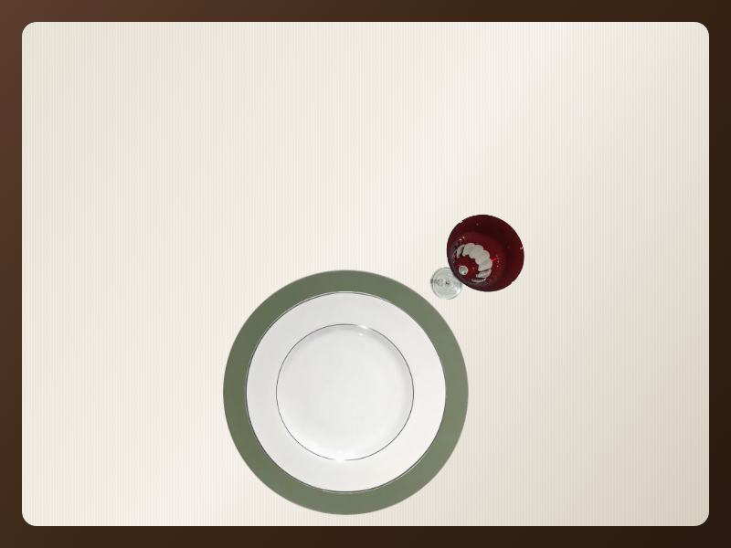

# Montagem de Mesa

**Português** | [English](README.en.md)



Aplicação web multi-tenant para lojas de mesa posta: o visitante escolhe peças por categoria, vê a pré-visualização em tempo real e envia a composição; o estabelecimento gerencia catálogo, leads e assinatura.

Cada conta tem login no admin, nome, logo, endereço público (`/:slug`) e catálogo editável. Auth, dados e imagens no **Supabase** (Auth + PostgreSQL + Storage + RLS). Toalhas fixas vêm de JSON local (não editáveis no painel). Trial de **14 dias**; sem acesso ativo, o painel e a página pública ficam bloqueados.

## Stack

| Camada | Tecnologia |
|--------|------------|
| Frontend | React 19 · Vite 8 · TypeScript · Tailwind 4 · React Router 7 · TanStack Query |
| Backend | Supabase (Auth, Postgres, Storage, Edge Functions) |
| Cobrança | Stripe (Checkout, Customer Portal, webhooks) |
| E-mail | Resend (notificação ao enviar montagem) |
| Host | Render (Static Site) |

## Pré-requisitos

- Node.js + npm
- Projeto no [Supabase](https://supabase.com)
- SMTP próprio recomendado (ex.: [Resend](https://resend.com)) — o e-mail padrão do Supabase é só para testes
- Conta [Stripe](https://stripe.com) (modo teste para desenvolvimento)

## Quick start

```bash
npm install
cp .env.example .env          # preencha as chaves (veja abaixo)
npm run db:migrate            # schema deste app (não reseta o Database)
npm run seed:supabase         # Auth + cliente demo + catálogo + imagens/
npm run dev
```

Abra a URL do Vite (em geral `http://localhost:5173`). A raiz `/` é a landing; a demo fica em `/raffiner`.

## Variáveis de ambiente

Copie [`.env.example`](.env.example) e preencha. Separe bem o que vai no frontend, nos scripts locais e nas Edge Functions.

### Frontend (Vite / Render)

| Variável | Uso |
|----------|-----|
| `VITE_SUPABASE_URL` | Project URL (`https://….supabase.co`) |
| `VITE_SUPABASE_ANON_KEY` | Chave `anon` `public` |
| `VITE_STRIPE_PUBLISHABLE_KEY` | Opcional (`pk_test_…`); Checkout por redirect não exige |

### Scripts locais (nunca no Vite / Render)

| Variável | Uso |
|----------|-----|
| `SUPABASE_SERVICE_ROLE_KEY` | Service role — só `npm run seed:supabase` |
| `DATABASE_URL` | URI do Postgres — `npm run db:migrate` (e seed transacional) |
| `SEED_EMAIL` | Opcional; padrão `financeiroraffiner@gmail.com` |
| `SEED_PASSWORD` | Obrigatório no seed (mín. 10 caracteres) |
| `DATABASE_SSL_REJECT_UNAUTHORIZED` | `false` só se o SSL local falhar a verificação de CA |

### Secrets das Edge Functions

Dashboard Supabase → Edge Functions → Secrets (ou `supabase secrets set`):

| Secret | Uso |
|--------|-----|
| `STRIPE_SECRET_KEY` | `sk_test_…` / `sk_live_…` |
| `STRIPE_WEBHOOK_SECRET` | `whsec_…` do endpoint de webhook |
| `STRIPE_PRICE_ID` | `price_…` do plano mensal |
| `SITE_URL` | Origem do app (`http://localhost:5173` ou domínio de produção) |
| `RESEND_API_KEY` | API key do Resend |
| `RESEND_FROM` | Remetente (ex.: `Montagem de Mesa <onboarding@resend.dev>` em testes) |

## Supabase

### Auth (URL Configuration)

Em **Authentication → URL Configuration**:

- **Site URL:** `http://localhost:5173` (em produção, o domínio do site)
- **Redirect URLs:**
  - `http://localhost:5173/admin`
  - `http://localhost:5173/admin/redefinir-senha`
  - `http://localhost:5173/admin/painel/cadastro`

Confirmação de cadastro → `/admin`; reset de senha → `/admin/redefinir-senha`; troca de e-mail → `/admin/painel/cadastro`.

### Checklist de segurança

1. **Authentication → Providers → Email** — confirmação de e-mail obrigatória; senha mínima **10** caracteres; preferir Secure password change.
2. Redirect URLs apenas do seu domínio.
3. Bot protection / rate limits no Auth quando disponível.
4. Catálogo e Storage são leitura pública só com assinatura/trial ativos (`cliente_tem_acesso`).

### Schema e migrations

```bash
npm run db:migrate
```

Aplica os arquivos em [`supabase/migrations/`](supabase/migrations/) (ordem lexicográfica): schema, trial/assinatura, otimizações, proteção de inserts/URLs e CRM com soft-delete.

Não reseta o Database do projeto. Alternativa sem `DATABASE_URL`: `supabase db query --linked -f supabase/migrations/ARQUIVO.sql`.

### Edge Functions

| Function | Papel |
|----------|--------|
| `criar-checkout` | Checkout Session de assinatura |
| `criar-portal` | Customer Portal (cartão / faturas) |
| `cancelar-assinatura` | Cancela no fim do período |
| `listar-faturas` | Histórico de faturas (+ sync se necessário) |
| `sincronizar-assinatura` | Stripe → `clientes` |
| `stripe-webhook` | Eventos Stripe → `clientes` (`verify_jwt` desligado) |
| `enviar-montagem` | Visitante envia montagem + e-mail via Resend (`verify_jwt` desligado) |

Deploy (CLI linkada ao projeto):

```bash
supabase secrets set \
  STRIPE_SECRET_KEY=sk_test_... \
  STRIPE_WEBHOOK_SECRET=whsec_... \
  STRIPE_PRICE_ID=price_... \
  SITE_URL=http://localhost:5173 \
  RESEND_API_KEY=re_... \
  RESEND_FROM='Montagem de Mesa <onboarding@resend.dev>'

supabase functions deploy criar-checkout
supabase functions deploy criar-portal
supabase functions deploy cancelar-assinatura
supabase functions deploy listar-faturas
supabase functions deploy sincronizar-assinatura
supabase functions deploy stripe-webhook --no-verify-jwt
supabase functions deploy enviar-montagem --no-verify-jwt
```

`supabase/config.toml` define `verify_jwt` por function.

## Stripe

1. Conta em [dashboard.stripe.com](https://dashboard.stripe.com) com **Test mode**.
2. Product + Price recorrente mensal → `STRIPE_PRICE_ID`.
3. API keys → `STRIPE_SECRET_KEY` (publishable opcional no frontend).
4. Customer Portal: ativar cartão, cancelar e faturas.
5. Webhook → `https://<PROJECT_REF>.supabase.co/functions/v1/stripe-webhook`  
   Eventos: `checkout.session.completed`, `customer.subscription.updated`, `customer.subscription.deleted`, `invoice.payment_failed`.  
   Signing secret → `STRIPE_WEBHOOK_SECRET`.
6. Cartão de teste: `4242 4242 4242 4242` ([docs](https://docs.stripe.com/testing)).

UI: [`/admin/assinatura`](src/funcionalidades/admin/AssinaturaAdmin.tsx) — trial/ativa, Assinar, Gerenciar cobrança, Cancelar no fim do período, faturas.

## Resend (enviar montagem)

Na montagem pública (`/:slug`), o visitante envia nome, e-mail, WhatsApp e endereço. A function `enviar-montagem` notifica o admin por e-mail e o app abre o WhatsApp do estabelecimento.

1. API key em [resend.com](https://resend.com) → `RESEND_API_KEY`.
2. Em testes, `RESEND_FROM` pode usar `onboarding@resend.dev`. Em produção, use domínio verificado.
3. Cadastre o WhatsApp em `/admin/painel/cadastro`.
4. Histórico e CRM de leads: `/admin/painel/montagens`.

## Seed e imagens

```bash
npm run seed:supabase
```

Requer `VITE_SUPABASE_URL`, `SUPABASE_SERVICE_ROLE_KEY` e `SEED_PASSWORD`:

- cria/atualiza o usuário Auth
- recria o cliente **Raffiner** (`slug=raffiner`) em trial (14 dias)
- importa [`src/dados/catalogo.json`](src/dados/catalogo.json)
- envia logo e fotos de [`imagens/`](imagens/) para o Storage
- atualiza as URLs no banco (não reescreve o JSON local)

Layout esperado:

```
imagens/logos/raffiner.webp
imagens/itens/raffiner/
  Sousplat/
  Pratos Rasos/
  Pratos Fundos/
  Pratos de sobremesa/
  Porta Guardanapos/
  Tacas/
```

## Rotas

| Rota | Descrição |
|------|-----------|
| `/` | Landing |
| `/:slug` | Montagem pública (enviar composição) |
| `/c/:slug` | Redirect legado → `/:slug` |
| `/admin`, `/entrar` | Login |
| `/cadastro` | Criar conta |
| `/admin/recuperar-senha` | Pedir reset de senha |
| `/admin/redefinir-senha` | Nova senha (após o link do e-mail) |
| `/admin/assinatura` | Trial, Checkout, Portal, faturas |
| `/admin/painel` | Catálogo (categorias e itens) + onboarding/ajuda |
| `/admin/painel/cadastro` | Nome, endereço, e-mail, logo e WhatsApp |
| `/admin/painel/montagens` | Histórico e CRM de leads |
| `/admin/painel/categorias/...` | CRUD de categorias e itens |

## Modelo de dados

| Recurso | Onde |
|---------|------|
| Usuários / senhas | Supabase Auth |
| Cliente (`clientes`) | Postgres — UUID, `slug`, `auth_user_id`, Stripe/trial |
| Montagens enviadas | `montagens_enviadas` — insert via Edge Function; CRM (`lead_status`, `nota_interna`) |
| Categorias e itens | Postgres — UUID; RLS com `cliente_tem_acesso` |
| Logos / fotos | Storage (`logos`, `itens`); fonte local em `imagens/` |
| Toalhas fixas | [`src/dados/toalhas.json`](src/dados/toalhas.json) |
| Assinatura | Stripe via Edge Functions |

## Scripts

| Comando | Função |
|---------|--------|
| `npm run dev` | Desenvolvimento |
| `npm run build` | Build de produção (`dist/`) |
| `npm run preview` | Preview do build |
| `npm run lint` | oxlint |
| `npm run test` | Vitest (uma vez) |
| `npm run test:watch` | Vitest em watch |
| `npm run db:migrate` | Aplica migrations via `DATABASE_URL` |
| `npm run seed:supabase` | Auth + cliente + catálogo + upload de `imagens/` |

## Estrutura do repositório

```
src/aplicacao/              # rotas, landing, página pública
src/dados/                  # cliente Supabase, repositórios, JSON
src/compartilhado/          # tipos, utils, ErrorBoundary
src/funcionalidades/
  admin/                    # login, painel, cadastro, assinatura, ajuda
  autenticacao/             # AuthProvider, rota protegida
  catalogo/                 # helpers do catálogo
  mesa/                     # seletor, preview, enviar montagem
imagens/                    # assets locais (seed → Storage)
public/ajuda/               # exemplos da ajuda do painel
supabase/migrations/        # schema, RLS, storage, trial, CRM
supabase/functions/         # Stripe + enviar-montagem
scripts/                    # migrate, seed, spa-fallback
render.yaml                 # deploy Static Site
```

## Deploy (Render)

| Campo | Valor |
|-------|--------|
| Build Command | `npm install && npm run build` |
| Publish Directory | `dist` |

Env no **build:** apenas `VITE_SUPABASE_URL` e `VITE_SUPABASE_ANON_KEY`. Não use service role nem `DATABASE_URL` no Render.

SPA: rewrite `/*` → `/index.html` (já em [`render.yaml`](render.yaml)).

Após o deploy: atualize Site URL e Redirect URLs no Auth; publique as Edge Functions e secrets; aponte o webhook Stripe para o projeto de produção.

## Convenções do app

- Categorias do seed usam `codigo` estável (`sousplat`, `pratoRaso`, …) para o preview; o PK é UUID.
- Categorias criadas no admin sem `codigo` aparecem no preview como camada genérica (se tiverem imagem).
- Pastas e rotas do código estão em português; UI do admin também.
